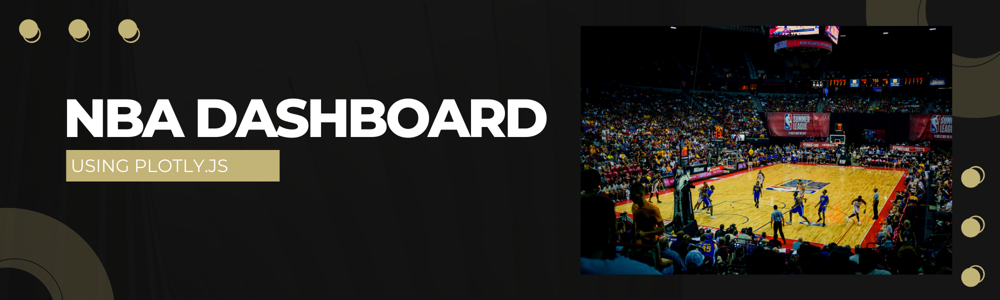
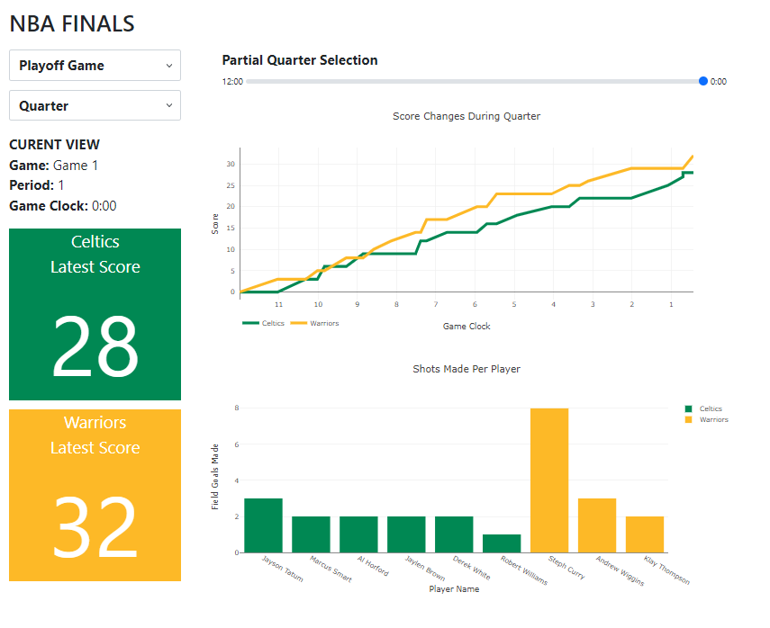

# plotly-dashboard-nba-championship

Author:  Erin James Wills, ejw.data@gmail.com  

<cite>Photo by [Kenny Eliason](https://unsplash.com/@neonbrand?utm_source=unsplash&utm_medium=referral&utm_content=creditCopyText) on [Unsplash](https://unsplash.com/s/photos/nba?utm_source=unsplash&utm_medium=referral&utm_content=creditCopyText)</cite>
 

## Overview  

Simple dashboard utilizing the NBA api to obtain play-by-play data that is filtered and aggregated for several plotly charts.  The dashboard uses several controls on the page for filtering.

 

## Github Pages  
Note:  Proxy server needs to be running for the page to be viewable
https://ejw-data.github.io/plotly-dashboard-nba-championship/  
   

 

## Technologies    
*  HTML/CSS/JS
*  Plotly.js
*  Flask Proxy Server

 

## Data Source  

Below is an example of how to form the api endpoint.  The information is specific to a particular game and the game id comes from https://www.nba.com/.  This information is often found in the url of the box score page.  

`date` = '20220602'   
`game_id` = '0042100401'  
`quarter` = 1    

url = `https://data.nba.net/prod/v1/`< date >`/`< game_id >`_pbp_`< quarter >`.json`;   

**Update**  
The api was replaced with another api but the new api does not work unless a proxy server modifies the headers.  The new url information is as follows:  

`game_id` = '0042100401'  
`proxyServer` = 'http://localhost:5000/'

url = < proxyServer >`https://cdn.nba.com/static/json/liveData/playbyplay/playbyplay_`< game_id >`.json`  

Note:  The proxy server is a flask app run locally.

 

## Setup and Installation  
1. Clone the repo to your local machine
1. Open repo folder in an IDE like VSCode
1. Using a virtual server like the VSCode extention LiveServer
1. Run `index.html`  
1. Due CORS block, you may need to apply a method to insert the correct headers so the api will load.  
    * Option 1:  Run a browser extension to bypass these restrictions.  I have been using the Chrome extension called "Moesif Origin & CORS Changer".  This extension has a toggle button to turn it on and off easily.  The page should display at this point assuming you have changed the `proxyserver` variable in `app.js` to "".  
    * Option 2:  This is how the repo is currently setup to run - First run the flask proxy server by navigating to the proxy folder in the repo in a terminal and running the flask server by typing `python proxy.py`.  Now when you open the index.html, it should load the data and graphics.  

 

## Example

